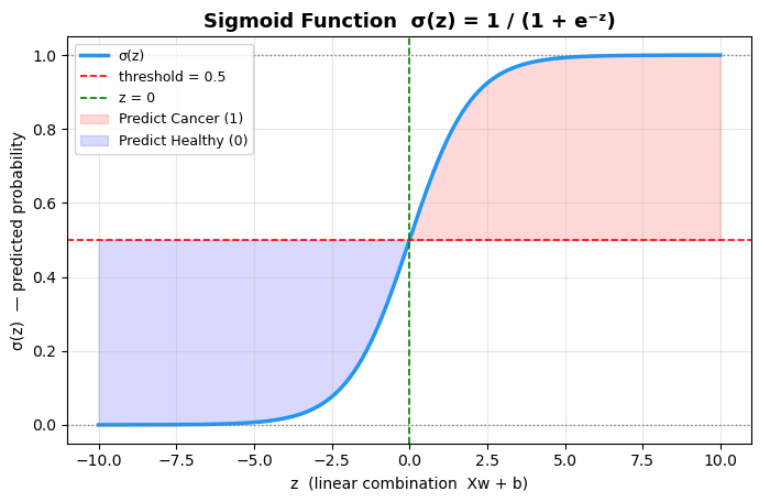
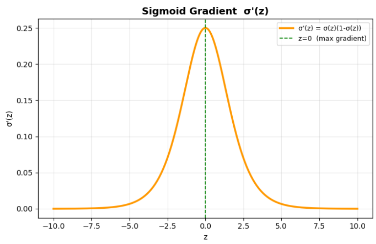

# Breast Cancer Classification using Logistic Regression (From Scratch)

## 📌 Overview
This project implements a **Logistic Regression model from scratch** using only Python, NumPy, and Pandas — without relying on any machine learning libraries like Scikit-learn.  

The goal is to classify patients as **Healthy (0)** or **Cancer (1)** based on their medical features. This project helped me understand **core machine learning concepts**, and it is inspired by the **Andrew Ng Machine Learning course**, where I learned how to implement models from the ground up.

---

## 🗂️ Dataset Description
The dataset used contains medical data of patients, including attributes such as:

- Age  
- BMI (Body Mass Index)  
- Glucose  
- Insulin  
- HOMA  
- Leptin  
- Adiponectin  
- Resistin  
- MCP-1  

The target variable (`Classification`) indicates whether the patient has cancer (encoded as 1 or 2, which we mapped to 0 = Healthy, 1 = Cancer).  

The dataset was cleaned, null values handled, and features normalized using **Z-score normalization** before training the model.

---

## 📊 Exploratory Data Analysis & Visualization

### 1. Feature Distributions by Class
To understand how features differ between Healthy and Cancer patients, histograms were plotted for each feature:

This helps in visualizing which features are more discriminative for classification.

### 2. Sigmoid Function
The core of Logistic Regression is the sigmoid function, which converts linear combinations of features into probabilities:

### 3. Sigmoid Gradient (Derivative)
The derivative of the sigmoid function is crucial for gradient descent optimization:

---

## 🛠️ Project Workflow

1. **Data Loading & Exploration**  
   - Load dataset using Pandas  
   - Inspect data types, shape, and missing values  

2. **Feature Selection & Label Encoding**  
   - Map target labels: 0 = Healthy, 1 = Cancer  
   - Select relevant features for training  

3. **Data Normalization**  
   - Apply Z-score normalization for stable and faster gradient descent  

4. **Train-Test Split**  
   - Shuffle dataset  
   - Use 80% for training and 20% for testing  

5. **Model Implementation**  
   - Define **sigmoid function**  
   - Implement **log loss (binary cross-entropy)**  
   - Compute **gradients w.r.t weights and bias**  
   - Train model using **gradient descent**  

6. **Model Evaluation**  
   - Confusion matrix  
   - Accuracy, Precision, Recall, F1-Score  

7. **Prediction**  
   - Predict on new patients  
   - Interactive system allows user input for real-time prediction  

8. **Interpretation**  
   - Analyze learned weights to determine feature importance  

---

## 🔑 Key Learnings
- Implemented Logistic Regression **from scratch** without sklearn  
- Understood **sigmoid function, gradient descent, and cost optimization**  
- Learned how to **evaluate classification models** using metrics like accuracy, precision, recall, and F1-score  
- Built an **interactive prediction system** to predict new patient outcomes  

This project strengthened my understanding of both the **theory and practical implementation** of Logistic Regression, inspired by Andrew Ng’s course methodology.

---
## 📬 Author
**Saatwik Sharma**  

Inspired by **Andrew Ng’s Machine Learning course project**
